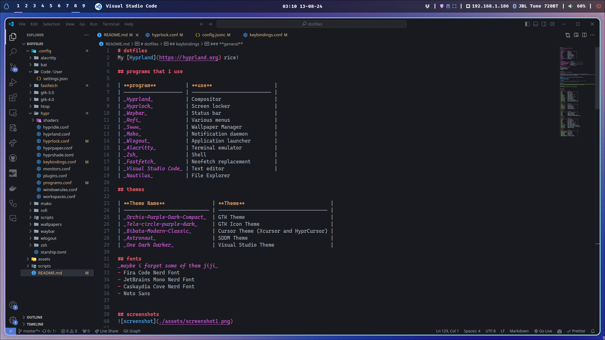

# dotfiles
My [Hyprland](https://hyprland.org) rice!


## screenshots




## programs that i use 

| **program**          | **use**                     |
| -------------------- | --------------------------- |
| _Hyprland_           | Compositor                  |
| _Hyprlock_           | Screen locker               |
| _Waybar_             | Status bar                  |
| _Rofi_               | Various menus               |
| _Swww_               | Wallpaper Manager           |
| _Mako_               | Notification daemon         |
| _Wlogout_            | Application launcher        |
| _Alacritty_          | Terminal emulator           |
| _Zsh_                | Shell                       |
| _Starship_           | Prompt                      |
| _Fastfetch_          | Neofetch replacement        |
| _Visual Studio Code_ | Text editor                 |
| _Nautilus_           | File Explorer

## themes

| **Theme Name**                | **Theme**                             |
| ----------------------------- | ------------------------------------- |
| _Orchis-Purple-Dark-Compact_  | GTK Theme                             |
| _Tela-circle-purple-dark_     | GTK Icon Theme                        |
| _Bibata-Modern-Classic_       | Cursor Theme (Xcursor and HyprCursor) |
| _Astronaut_                   | SDDM Theme                            |
| _One Dark Darker_             | Visual Studio Theme                   |

## fonts
_maybe i forget some of them jiji_
- Fira Code Nerd Font
- JetBrains Mono Nerd Font
- Caskaydia Cove Nerd Font
- Noto Sans

## installation
To install the dotfiles, you need to clone the repository and run the installation scripts.
All the packages are listed in the [install_packages](./install/install_packages.sh). You can modify it to your needs.
This script _may_ not work, i use it to list my packages 

```bash
git clone --depth 1 --branch main https://github.com/daniqss/dotfiles.git
cd dotfiles
./install/install_packages.sh
./install/install_configs.sh
```
> [!WARNING]  
> The script will remove all the config folders that may conflict with the dotfiles.
> Make sure to backup your files before running the script.
> Also, it's unupdated, jeje💀💀

### sddm theme
```bash
sudo git clone https://github.com/keyitdev/sddm-astronaut-theme.git /usr/share/sddm/themes/sddm-astronaut-theme
sudo cp /usr/share/sddm/themes/sddm-astronaut-theme/Fonts/* /usr/share/fonts/

echo "[Theme]
Current=sddm-astronaut-theme" | sudo tee /etc/sddm.conf
```

## keybindings

### **movement**

| **Bind**             | **Action**                     |
| -------------------- | ------------------------------ |
| `mod+H`              | Move focus left                |
| `mod+J`              | Move focus up                  |
| `mod+K`              | Move focus down                |
| `mod+L`              | Move focus right               |
| `mod+Shift+H`        | Swap window to the left        |
| `mod+Shift+J`        | Swap window up                 |
| `mod+Shift+K`        | Swap window down               |
| `mod+Shift+L`        | Swap window to the right       |
| `mod+Control+H`      | Resize window left             |
| `mod+Control+J`      | Resize window up               |
| `mod+Control+K`      | Resize window down             |
| `mod+Control+L`      | Resize window right            |
| `mod+mouse_down`     | Scroll to next workspace       |
| `mod+mouse_up`       | Scroll to previous workspace   |
| `mod+ALT+[0-9]`      | Move window to specific workspace |

### **rofi menus**

| **Bind**             | **Action**                     |
| -------------------- | ------------------------------ |
| `mod+Tab`            | Launch wofi                    |
| `mod+Control+L`      | Launch logout menu             |
| `mod+Control+W`      | Launch WiFi menu               |
| `mod+Control+B`      | Launch Bluetooth menu          |
| `mod+Control+S`      | Launch sound menu              |
| `mod+Control+E`      | Launch emoji picker            |
| `mod+Control+C`      | Launch clipboard manager       |

### **layouts**

| **Bind**             | **Action**                     |
| -------------------- | ------------------------------ |
| `mod+O`              | Switch to dwindle layout       |
| `mod+I`              | Toggle split layout            |
| `mod+Q`              | Toggle floating mode           |
| `mod+F`              | Toggle fullscreen mode         |
| `mod+S`              | Toggle special workspace (magic) |
| `mod+ALT+S`          | Move window to special workspace (magic) |

### **general**

| **Bind**             | **Action**                     |
| -------------------- | ------------------------------ |
| `mod+Enter`          | Launch terminal                |
| `mod+N`              | Launch hyprlock                |
| `mod+W`              | Kill focused window            |
| `mod+M`              | Kill hyprland                  |
| `mod+P`              | Open workspace default app     |
| `mod+B`              | Hide waybar                    |
| `mod+Space`          | Switch keyboard layout         |
| `Print`              | Take screenshot (Hyprshot)     |
| `mod+M` or `Print`   | Take region screenshot         |
| `mod+mouse:272`      | Move window (drag with left click) |
| `mod+mouse:273`      | Resize window (drag with right click) |
| `mod+mouse:274`      | Move window to special workspace (magic) |
| `mod+mouse:275`      | Toggle pseudo mode             |
| `mod+mouse:276`      | Toggle floating mode           |

### **media**

| **Bind**             | **Action**                     |
| -------------------- | ------------------------------ |
| `XF86AudioRaiseVolume` | Raise volume                 |
| `XF86AudioLowerVolume` | Lower volume                 |
| `XF86AudioMute`      | Mute volume                    |
| `XF86AudioPlay`      | Play/Pause media               |
| `XF86AudioPrev`      | Previous track                 |
| `XF86AudioNext`      | Next track                     |
| `XF86MonBrightnessUp` | Increase brightness           |
| `XF86MonBrightnessDown` | Decrease brightness         |

