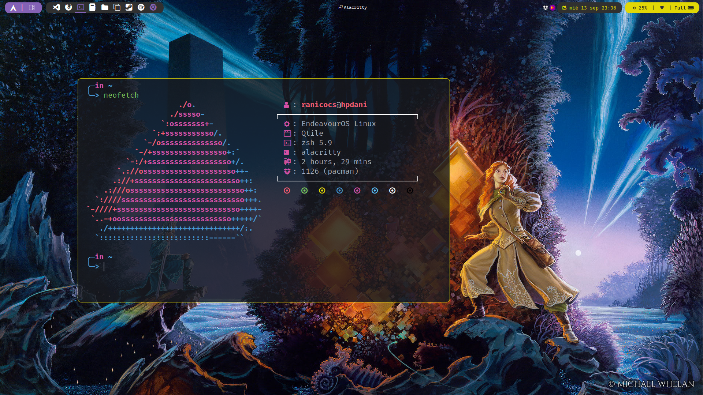
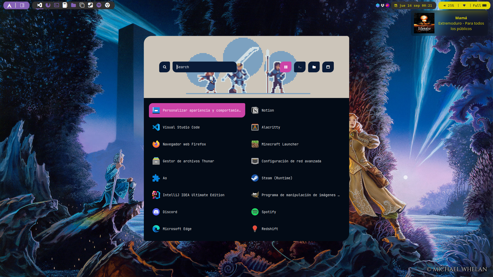

# dotfiles


### Info

- **OS**: [EndeavourOS Qtile](https://discovery.endeavouros.com/window-tiling-managers/qtile/)
- **Window Manager:** [Qtile](#Qtile)
- **Launcher:** [Rofi](#Rofi)
- **Compositor:** [Picom Jonaburg](https://github.com/jonaburg/picom
- **Terminal:** [Alacritty](#Terminal)
- **Lockscreen:** betterlockscreen
- **File Manager:** thunar
- **GTK Theme**: [yaru-magenta-dark](https://aur.archlinux.org/packages/yaru-gtk-theme)
- **Notifications**: [dunst](https://github.com/dunst-project/dunst)
- **Fonts:**  FiraCodeNerdFont, CaskaydiaCoveNerdFont, CascadiaCode, OpenSans, liberation, noto

## Qtile

* [Qtile](qtile.org)
* [Qtile Extras](https://github.com/elParaguayo/qtile-extras)
* `~/.config/qtile`
* `~/.config/qtile/autostart.sh`
``` bash
# Screens
# screens &
xrandr --output DP-4 --mode 1920x1080 --rate 120.00

# Wallpaper
feh --bg-scale ~/.config/Wallpapers/RoW01.jpg & disown

# Composer
picom & disown # --experimental-backends --vsync should prevent screen tearing on most setups if needed

# Lock Screen Randomizer
# betterlockscreen -u $HOME/Wallpapers --fx blur & disown

# /usr/lib/polkit-gnome/polkit-gnome-authentication-agent-1 & disown # start polkit agent from GNOME

# Gnome keyring
dbus-update-activation-environment --all &
gnome-keyring-daemon --start --components=secrets &
```

### Keybindings

| **Keybindings** | **Actions** |
| ---- | ---- |
| `mod+space` | Move window focus to other screen |
| `mod+Shift+h` | Move window to the left |
| `mod+Shift+l` | Move window to the right |
| `mod+Shift+j` | Move window down |
| `mod+Shift+k` | Move window up |
| `mod+Control+h` | Grow window |
| `mod+Control+l` | Shrink window |
| `mod+n` | Reset all window sizes |
| `mod+Shift+Return` | Toggle between split and unsplit sides |
| `mod+q` | Toggle between layouts |
| `mod+w` | Kill focused window |
| `mod+Shift+Control+h` | Swap column to the left |
| `mod+Shift+Control+l` | Swap column to the right |
| `mod+Shift+space` | Flip layout |
| `mod+Control+r` | Restart Qtile |
| `mod+Control+q` | Shutdown Qtile |
| `mod+f` | Toggle floating window |
| `mod+Enter` | Launch terminal |
| `mod+Tab` | Rofi run |
| `alt+Tab` | Rofi windows |
| `mod+alt+Tab` | Power Menu |
| `mod+e` | Rofi emoji |
| `mod+p` | Open workspace default app |
| `mod+n` | Reset all windows sizes |
| `Print` | Screenshot |
| `mod + Print` | Screenshot GUI |


### Default Apps

| Workspace | Use | Default App |
| ---- | ---- | ---- |
| 1 | Editor | VS Code |
| 2 | Work Browser | Brave |
| 3 | Terminal Emulator | Alacritty |
| 4 | Notes | Obsidian |
| 5 | File Manager | Thunar |
| 6 | Miscellany | Rofi |
| 7 | Games | Steam |
| 8 | Music | Spotify |
| 9 | Entertainment Browser | Chrome |

## Rofi
[Rofi](https://github.com/jonaburg/picom)

## Terminal
### Terminal Emulator
* [**Alacritty**](https://github.com/alacritty/alacritty)
* `~/.config/alacritty/alacritty.yml`

### Shell
* [**Zsh**](zsh.org) 
* `~/.config/zsh/.zshrc`
- **Plugins**
	- [Autosuggestions](https://github.com/zsh-users/zsh-autosuggestions)
	- [Shift Select](https://github.com/jirutka/zsh-shift-select)
	- [Syntax Highlighting](https://github.com/zsh-users/zsh-syntax-highlighting)

### Prompt
* [**Starship**](https://starship.rs/)
* `~/config/starship.toml`
### Neofetch
* [**Neofetch**](https://github.com/dylanaraps/neofetch)
* `/.config/neofetch/config.conf`
- **Theme** -> [Neofetch themes](https://github.com/Chick2D/neofetch-themes)
### Packages

| Package Name | Description | Package Manager |
| ---- | ---- | ---- |
| [ bat ](https://github.com/sharkdp/bat) | cat clone | pacman |
| [ lsd ](https://github.com/lsd-rs/lsd) | ls clone | pacman |
| [ btm ](https://github.com/ClementTsang/bottom) | system monitor | pacman |
| [ yay ](https://github.com/Jguer/yay) | AUR helper | pacman |
|  |  |  |


# Miscellany
## Gaming
### Nvidia drivers
* https://github.com/korvahannu/arch-nvidia-drivers-installation-guide
### Packages

| Package | Version | How to install |
| ---- | ---- | ---- |
| `lib32-nvidia-utils` | 545.29.06-1 | pacman |
| `nvidia` | 545.29.06-6 | pacman |
| `nvidia-hook` | 1.3-1 | pacman |
| `nvidia-inst` | 23.1-1 | pacman |
| `nvidia-settings` | 545.29.06-1 | pacman |
| `nvidia-utils` | 545.29.06-1 | pacman |
| `opencl-nvidia` | 545.29.06-1 | pacman |
| `xpadneo` |  | git clone |
| `steam` | 1.0.0.78-2 | pacman |
| `discord canary` | 0.0.231-1 | yay |
## Other themes
- **Lightdm** -> [glorious](https://github.com/eromatiya/lightdm-webkit2-theme-glorious)
- **GTK Theme** -> [yaru-magenta-dark](https://aur.archlinux.org/packages/yaru-colors-gtk-theme)

## Bluetooth
| Package |
| ---- |
| `bluez-utils` |
| `bluez` |
| `bluetoothctl` |
| `blueman` |


# Screenshots




