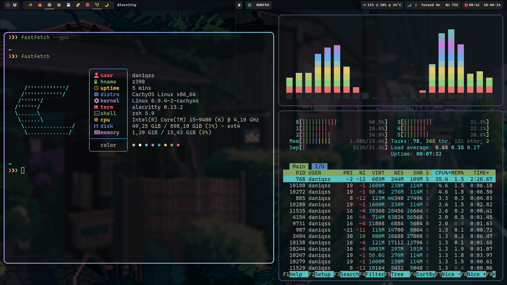
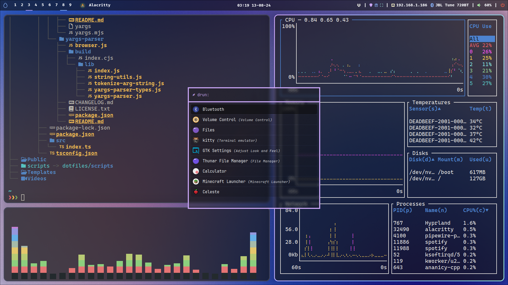

# 🌹garden
My [Hyprland](https://hyprland.org) and [waybar](https://github.com/Alexays/waybar) rice!

## screenshots



## installation
To install the dotfiles, you need to clone the repository and run the installation scripts.
All the packages are listed in the [install_packages](./install/install_packages.sh). You can modify it to your needs.
This script _may_ not work, i use it to list my packages 

```bash
git clone --depth 1 --branch main https://github.com/daniqss/dotfiles.git
cd dotfiles
./install/install_packages.sh
./install/install_configs.sh
```
> [!WARNING]  
> The script will remove all the config folders that may conflict with the dotfiles.
> Make sure to backup your files before running the script.

### Sddm theme
```bash
sudo git clone https://github.com/keyitdev/sddm-astronaut-theme.git /usr/share/sddm/themes/sddm-astronaut-theme
sudo cp /usr/share/sddm/themes/sddm-astronaut-theme/Fonts/* /usr/share/fonts/

echo "[Theme]
Current=sddm-astronaut-theme" | sudo tee /etc/sddm.conf
```

## Keybindings

| **Bind**             | **Action**                 |
| -------------------- | -------------------------- |
| `mod+Enter`          | Launch terminal            |
| `mod+space`          | Switch keyboard layout     |
| `mod+n`              | Launch hyprlock            |
| `mod+q`              | Toggle floating mode       |
| `mod+w`              | Kill focused window        |
| `mod+m`              | Kill hyprland              |
| `mod+f`              | Toggle fullscreen          |
| `mod+Tab`            | Launch wofi                |
| `mod+e`              | Smile                      |
| `mod+p`              | Open workspace default app |
| `mod+b`              | hide waybar                |
| `Print` || `mod+m`   | Screenshot                 |
| `Print`              | Hyprshot                   |
| `mod+Shift+[hjkl]`   | Move window                |
| `mod+Control+[hjkl]` | Resize window              |
| `mod+[hjkl]`         | Focus window               |

