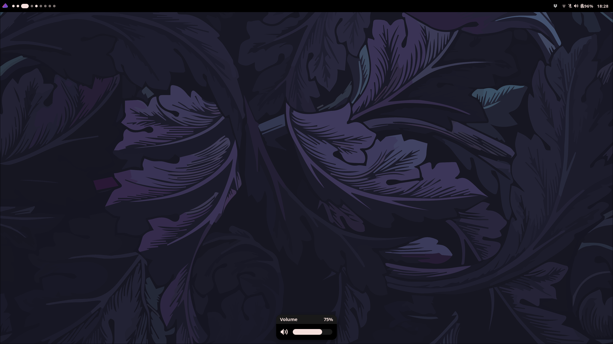

# dotfiles
My [hyprland](https://hyprland.org) rice!

## screenshots

## installation
to set up this rice:
1. install all the packages listed in [scripts/install_packages.sh](scripts/install_packages.sh)(i use the [chaotic aur](https://aur.chaotic.cx/))
2. use [stow](https://www.gnu.org/software/stow/) to create symlinks in your `$HOME/.config`
3. clone [Orchid theme](https://github.com/vinceliuice/Orchis-theme) and generate the theme using `./install.sh --tweaks black -c dark -t purple -l`
4. clone my [custom desktop shell](https://github.com/daniqss/shell) and run `ags run -d shell`

## keybindings
### **movement**

| **Bind**             | **Action**                     |
| -------------------- | ------------------------------ |
| `mod+H`              | Move focus left                |
| `mod+J`              | Move focus up                  |
| `mod+K`              | Move focus down                |
| `mod+L`              | Move focus right               |
| `mod+Shift+H`        | Swap window to the left        |
| `mod+Shift+J`        | Swap window up                 |
| `mod+Shift+K`        | Swap window down               |
| `mod+Shift+L`        | Swap window to the right       |
| `mod+Control+H`      | Resize window left             |
| `mod+Control+J`      | Resize window up               |
| `mod+Control+K`      | Resize window down             |
| `mod+Control+L`      | Resize window right            |
| `mod+mouse_down`     | Scroll to next workspace       |
| `mod+mouse_up`       | Scroll to previous workspace   |
| `mod+ALT+[0-9]`      | Move window to specific workspace |

### **rofi menus**

| **Bind**             | **Action**                     |
| -------------------- | ------------------------------ |
| `mod+Tab`            | Launch wofi                    |
| `mod+Control+L`      | Launch logout menu             |
| `mod+Control+W`      | Launch WiFi menu               |
| `mod+Control+B`      | Launch Bluetooth menu          |
| `mod+Control+S`      | Launch sound menu              |
| `mod+Control+E`      | Launch emoji picker            |
| `mod+Control+C`      | Launch clipboard manager       |

### **layouts**

| **Bind**             | **Action**                     |
| -------------------- | ------------------------------ |
| `mod+O`              | Switch to dwindle layout       |
| `mod+I`              | Toggle split layout            |
| `mod+Q`              | Toggle floating mode           |
| `mod+F`              | Toggle fullscreen mode         |
| `mod+S`              | Toggle special workspace (magic) |
| `mod+ALT+S`          | Move window to special workspace (magic) |

### **general**

| **Bind**             | **Action**                     |
| -------------------- | ------------------------------ |
| `mod+Enter`          | Launch terminal                |
| `mod+N`              | Launch hyprlock                |
| `mod+W`              | Kill focused window            |
| `mod+M`              | Kill hyprland                  |
| `mod+P`              | Open workspace default app     |
| `mod+B`              | Hide waybar                    |
| `mod+Space`          | Switch keyboard layout         |
| `Print`              | Take screenshot (Hyprshot)     |
| `mod+M` or `Print`   | Take region screenshot         |
| `mod+mouse:272`      | Move window (drag with left click) |
| `mod+mouse:273`      | Resize window (drag with right click) |
| `mod+mouse:274`      | Move window to special workspace (magic) |
| `mod+mouse:275`      | Toggle pseudo mode             |
| `mod+mouse:276`      | Toggle floating mode           |

### **media**

| **Bind**             | **Action**                     |
| -------------------- | ------------------------------ |
| `XF86AudioRaiseVolume` | Raise volume                 |
| `XF86AudioLowerVolume` | Lower volume                 |
| `XF86AudioMute`      | Mute volume                    |
| `XF86AudioPlay`      | Play/Pause media               |
| `XF86AudioPrev`      | Previous track                 |
| `XF86AudioNext`      | Next track                     |
| `XF86MonBrightnessUp` | Increase brightness           |
| `XF86MonBrightnessDown` | Decrease brightness         |

